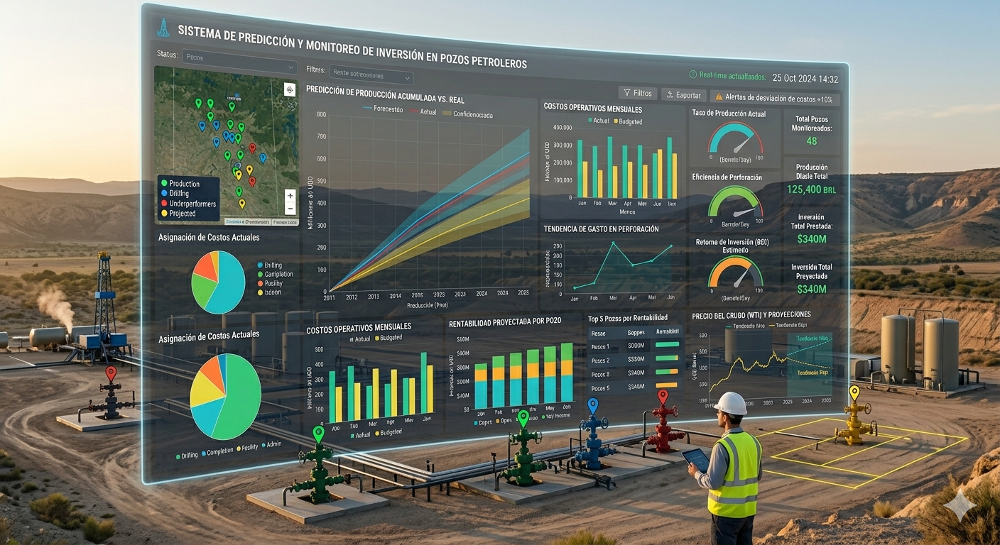
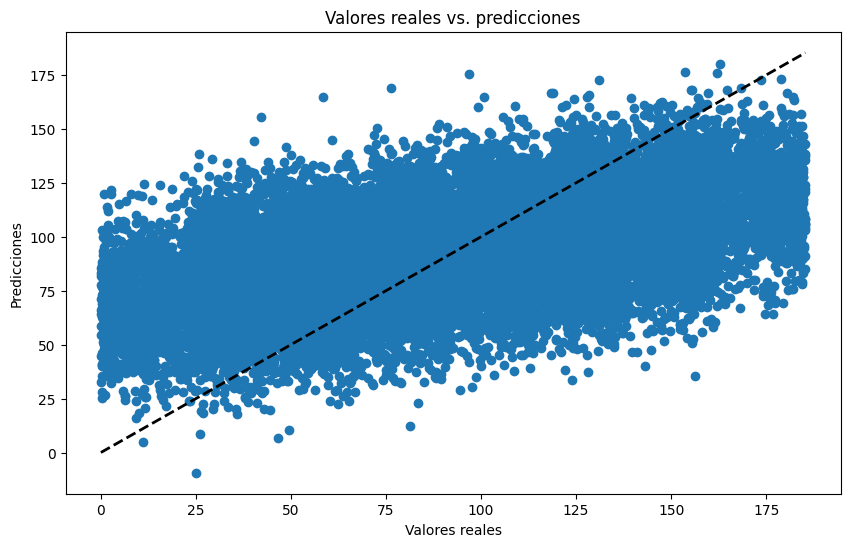
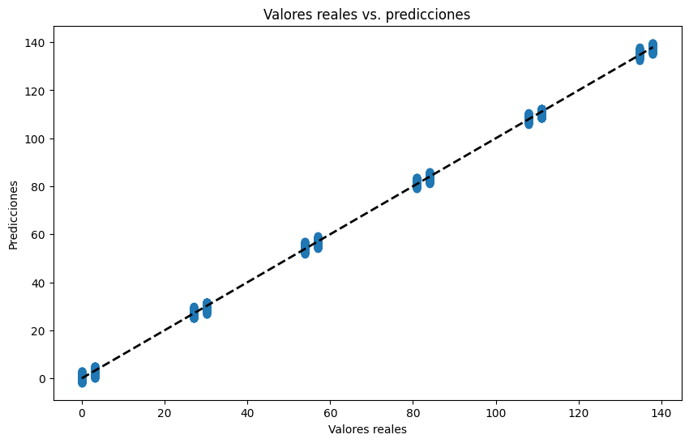

# Predicción de inversion en pozos petroleros

 
 
 

## **Descripción del proyecto**
La compañía de extracción de petróleo OilyGiant esta buscando invertir en los mejores lugares para abrir 200 pozos nuevos de petróleo.

Se tienen datos sobre muestras de crudo de tres regiones. Ya se conocen los parámetros de cada pozo petrolero de la región. Se tendra que crear un modelo que ayude a elegir la región con el mayor margen de beneficio, analizando los beneficios y riesgos potenciales de acuerdo con las siguientes condiciones:

* Al explorar la región, se lleva a cabo un estudio de 500 puntos con la selección de los mejores 200 puntos para el cálculo del beneficio.
* El presupuesto para el desarrollo de 200 pozos petroleros es de 100 millones de dólares.
* Un barril de materias primas genera 4.5 USD de ingresos. El ingreso de una unidad de producto es de 4500 dólares (el volumen de reservas está expresado en miles de barriles).
* Después de la evaluación de riesgo, mantén solo las regiones con riesgo de pérdidas inferior al 2.5%. De las que se ajustan a los criterios, se debe seleccionar la región con el beneficio promedio más alto.

 
 
 

## **Objetivo del proyecto**

La secuencia seguida para el desarrollo de este proyecto, junto con los objetivos se muestra a continuación:

* Se analizó el conjunto de datos de cada región individualmente. En cada región se hizo una análisis exploratorio de datos en busca de valores nulos o faltantes y de tendencias en la información.

* Ya verificada y estandarizada la información de los tres conjuntos, se hizo un conjunto único para evitar tener código adicional.

* Con el conjunto de datos único, se dividió en conjunto de prueba y entrenamiento. Se realizó la predicción con el conjunto de entrenamiento buscando aquella región con las métricas más bajas.

* Una vez identificada la región con mejor comportamiento en la predicción, se realizó el cálculo de mayor producción por región. Se enfoco en aquella región que estuviera más cerca del umbral de 111.11 unidades de producto para poder tener ganancias.

* También se realizó el cálculo de ganancias, basándose en los análisis anteriores, considerando los mejores 200 pozos para cade región.

* Finalmente, se cálculo el riesgo y ganancias por región utilizando la estrategia de bootstrap con una muestras de 1000 pozos.  
 
 
 

## **Lenguajes y herramientas usadas**

Plataforma: Jupyter Notebook.

Análisis exploratorio de datos: Python, Pandas, Matplotlib, Scikit-learn, Seaborn, Numpy. 

Modelo de predicción: Linear Regression.

Análisis de negocio y pruebas: Bootstrapping, Profit Calculation, Risk Analysis.

Metricas de evaluación: Error Absoluto Medio (MEA), Error Cuadrático Medio (MSE), R2, RMSE.

 
 
 

## **Conclusiones**

Los resultados obtenidos despues del analisis de todos los escenarios, es el siguiente:
1. Para el análisis del **modelo de predicción de regresion linear, el mejor fue el de la región 1.**

**Región 0:**

**Región 1:**

3. Para el cálculo de **ganancias usando el umbral de unidades de producto, el mejor fue el de la región 2.**
4. Para el **beneficio esperado utilizando los mejores 200 pozos por region, el mejor fue el de la región 0.**
5. Para el **beneficio esperado utilizando la estrategia de bootstrap con 1000 muestras y seleccionando los mejores 200 pozos, el mejor fue la region 0.**

Dicho lo anterior, la región recomendada para invertir es la region 0. 
